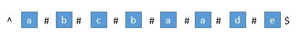
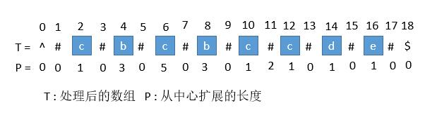
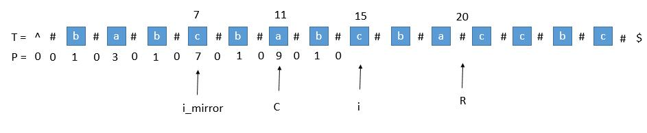

## 3. 无重复字符的最长子串

- 优化的滑动窗口

如果s\[j\]在[i,j)范围内有与j'重复的字符，我们不需要逐渐增加i；
我们可以直接跳过\[i，j'\]范围内的所有元素，并将i变为j'+1

算法：

保持一个int max变量来记录最长子串的长度，每次移动右指针时都重新比较当前窗口
的长度与max，如果当前窗口表示的子串长度大于max，则更新max

当s\[j'\] = s\[j\]时，如果[i, j)范围内都没有重复的元素，
那么最长的子串一定至少是s\[i, j-1\]，
将i移动到这个范围中的任何位置得到的都不会比这个子串长，
所以可以直接移动i到j'+1位置寻找下一个可能的最长子串

最后返回max即可

Note：
1. 使用哈希表来记录当前滑动窗口内有哪些字符，当移动右指针时向表内添加新遍历到的字符，
当移动左指针时从表内删除从窗口中排除掉的字符
2. 简化掉删除操作：如果哈希表保存的是"某字符在出现的最靠右位置的索引"而不是"是否在滑动窗口中出现"的话，
就可以通过这个索引判断字符是否在滑动窗口内，而不需要进行删除操作

原理：通过判断表内字符对应的索引是否在左指针左边；
原本在左指针左边的字符应该从表内删除，现在如果对应索引在左指针左边则忽略，若在右边，
则改变左指针位置；由于每次移动右指针都会更新右指针对应字符的索引，
发生s\[j'\] = s\[j\]情况时，左指针被移动到j+1位置，而此字符对应索引j'被更新到j

3. 哈希表将一个字符映射到其对应索引上，而使用一个散列表
（索引为对应字符的ASCII编码减去' '的编码，值为字符对应索引）
可以用空间换时间来提高效率


```java
class Solution3 { // Hashmap
    public int lengthOfLongestSubstring(String s) {
        char[] arr = s.toCharArray();
        if (arr.length == 0) return 0;
        int ptr1 = 0;
        int ptr2 = 0;

        int max = 1;
        Map map = new HashMap();

        while (ptr2 != arr.length) {
            if (map.containsKey(arr[ptr2])){
                if ((int) map.get(arr[ptr2]) >= ptr1) ptr1 = (int) map.get(arr[ptr2])+1;
            }
            map.put(arr[ptr2], ptr2);
            if (ptr2 - ptr1 + 1 > max) max = ptr2-ptr1+1;
            ptr2++;
        }
        return max;
    }
}
``` 

```java
class Solution3 { // Array
    public int lengthOfLongestSubstring(String s) {
        char[] arr = s.toCharArray();
        if (arr.length == 0) return 0;
        int ptr1 = 0;
        int ptr2 = 0;

        int max = 1;
        int[] map = new int[128];
        for (int i=0; i<128; i++) map[i] = -1;

        while (ptr2 != arr.length) {
            if (map[arr[ptr2]-' '] >= ptr1) ptr1 = map[arr[ptr2]-' '] + 1;
            map[arr[ptr2]-' '] = ptr2;
            if (ptr2 - ptr1 + 1 > max) max = ptr2 - ptr1 + 1;
            ptr2++;
        }
        return max;
    }
}
```

## 5. 最长回文子串

- 动态规划：刷表

横/纵坐标表示子串的起始位置，true/false表示这个子串是不是回文

 T | 0 | 1 | 2 | 3 |...| n-1 |
---|---|---|---|---|---| --- |
 0 | true | \ | \ | \ |...| \ |
 1 | s\[0\] == s\[1\] | true | \ | \ |...| \ |
 2 | s\[0\] == s\[2\] && T\[1\]\[1\] | s\[1\] == s\[2\] | true | \ |...| \ |
 3 | s\[0\] == s\[3\] && T\[1\]\[2\] | s\[1\] == s\[3\] && T\[2\]\[2\] | s\[0\] == s\[2\]| true |...| \ |
...|...|...|...|...|...| \ |
n-1| s\[0\] == s\[n-1\] && T\[1\]\[n-2\]| s\[1\] == s\[n-1\] && T\[2\]\[n-2\]| s\[2\] == s\[n-1\] && T\[3\]\[n-2\]| s\[3\] == s\[n-1\] && T\[4\]\[n-2\]|...| true |

表计算完毕后即可得到最长回文子串

- 动态规划：递归

按上表的表示方式，x为横坐标（子串开头），y为纵坐标（子串结尾）

如果我们把x > y（子串的开头在结尾后方）当做真的话：

1. 当x=y时，T\[x\]\[y\]一定为真，等于 (s\[x\] == s\[y\]) && T\[x+1\]\[y-1\]

    （x=y，故s\[x\]一定等于s\[y\]，x+1 > y-1，故T\[x+1\]\[y-1\]按照一开始的设定，为真）
    
2. 当x=y+1时，T\[x\]\[y\]等于 (s\[x\] == s\[y\]) && T\[x+1\]\[y-1\]

    （x+1 > y-1，故T\[x+1\]\[y-1\]按照一开始的设定，为真）
    
3. 其它情况同样，T\[x\]\[y\]等于 (s\[x\] == s\[y\]) && T\[x+1\]\[y-1\]

递归关系式：
f(x, y) = (s\[x\]==s\[y\]) && f(x+1, y-1) if x <= y
f(x, y) = true if x > y

（在类中）声明一个全局变量来记录每次递归得到的子串是否更长，如果是，将子串起始位置
记录在全局变量中，最终得到最长回文子串

- 动态规划：自底向上

先算出子问题的结果（父问题对应的格子右上角子问题的结果），再一路解决上层的问题直到结束。

同样（在类中）声明一个全局变量来记录每次解决的子问题对应的子串是否更长，如果是，将子串起始位置
记录在全局变量中，最终得到最长回文子串

- Manacher's Algorithm（马拉车算法）

先跪为敬...

马拉车算法 Manacher‘s Algorithm 是用来查找一个字符串的最长回文子串的线性方法，
由一个叫 Manacher 的人在 1975 年发明的，这个方法的最大贡献是在于将时间复杂度提升到了线性。

首先我们解决下奇数和偶数的问题，在每个字符间插入 "#"，
并且为了使得扩展的过程中，到边界后自动结束，在两端分别插入 "^" 和 "$"，
两个不可能在字符串中出现的字符，这样中心扩展的时候，判断两端字符是否相等的时候，
如果到了边界就一定会不相等，从而出了循环。经过处理，字符串的长度永远都是奇数了。



首先我们用一个数组 P 保存从中心扩展的最大个数，
而它刚好也是去掉 "#" 的原字符串的总长度。

例如下图中下标是 6 的地方，可以看到 P\[6\] 等于 5，
所以它是从左边扩展 5 个字符，相应的右边也是扩展 5 个字符，
也就是 "#c#b#c#b#c#"。而去掉 # 恢复到原来的字符串，
变成 "cbcbc"，它的长度刚好也就是 5。



#### 求原字符串下标

用 P 的下标 i 减去 P\[\i\]，再除以 2，就是原字符串的开头下标了。

例如我们找到 P\[i\] 的最大值为 5，也就是回文串的最大长度是 5，
对应的下标是 6，所以原字符串的开头下标是（6 - 5 ）/ 2 = 0。
所以我们只需要返回原字符串的第 0 到 第（5 - 1）位就可以了。

#### 求每个 P\[i\]

接下来是算法的关键了，它充分利用了回文串的对称性。

我们用 C 表示回文串的中心，用 R 表示回文串的右边半径。
所以 R = C + P\[i\]。C 和 R 所对应的回文串是当前循环中 R 最靠右的回文串。

让我们考虑求 P\[i\] 的时候，如下图。

用 i_mirror 表示当前需要求的第 i 个字符关于 C 对应的下标。


我们现在要求P\[i\]，如果是用中心扩展法，那就向两边扩展比对就行了。
但是我们其实可以利用回文串 C 的对称性。
**i 关于 C 的对称点是 i_mirror，P\[i_mirror\] = 3，所以P\[i\] 也等于 3。**（算法核心！！）

但是有三种情况将会造成直接赋值为P\[i_mirror\] 是不正确的，下边一一讨论。

1. 超出了 R



当我们要求P\[i\]的时候，P\[mirror\] = 7，而此时P\[i\]并不等于 7，
为什么呢，因为我们从 i 开始往后数 7 个，等于 22，已经超过了最右的 R，此时不能利用对称性了，
但我们一定可以扩展到 R 的，所以 P [ i ] 至少等于 R - i = 20 - 15 = 5，

会不会更大呢，我们只需要比较T\[R+1\]和T\[R+1\]关于 i 的对称点就行了，
就像中心扩展法一样一个个扩展。

2. P\[i_mirror\]遇到了原字符串的左边界


此时P\[i_mirror\] = 1，但是P\[i\]赋值成 1 是不正确的，
出现这种情况的原因是P\[i_mirror\]在扩展的时候首先是 "#" == "#"，
之后遇到了 "^" 和另一个字符比较，也就是到了边界，才终止循环的。
而P\[i\]并没有遇到边界，所以我们可以继续通过中心扩展法一步一步向两边扩展就行了。

3. i 等于了 R

此时我们先把P\[i\]赋值为 0，然后通过中心扩展法一步一步扩展就行了。

#### 考虑 C 和 R 的更新

就这样一步一步的求出每个P\[i\]，当求出的P\[i\]的右边界大于当前的 R 时，
我们就需要更新 C 和 R 为当前的回文串了。
因为我们必须保证 i 在 R 里面，所以一旦有更右边的 R 就要更新 R。


此时的P\[i\]求出来将会是 3，P\[i\]对应的右边界将是 10 + 3 = 13，
所以大于当前的 R，我们需要把 C 更新成 i 的值，也就是 10，R 更新成 13。
继续下边的循环。

例子：


## 6. Z 字形变换

- 另一种解法：

题目理解：
字符串 s 是以 Z 字形为顺序存储的字符串，目标是按行打印。

设 numRows 行字符串分别为s1, s2 ,..., sn，则容易发现：按顺序遍历字符串 s 时，
每个字符 c 在Z字形中对应的行索引先从s1增大至sn，再从sn​减小至s1......如此反复。

因此，解决方案为：模拟这个行索引的变化，在遍历s中把每个字符填到正确的行res\[i\] 。

算法流程： 按顺序遍历字符串s；res\[i\] += c： 把每个字符c填入对应行si​；i += flag： 
更新当前字符 c 对应的行索引；flag = - flag： 在达到Z字形转折点时，执行反向。

## 7. 整数反转
- Case: -2147483648

Java整数只支持-2147483648 (-2^31) 到 2147483647 (2^31-1) 范围内的数字

如果遇到负数时乘-1处理, 遇到-2147483648会溢出, 因为**-2147483648是一个有效的java整数，但是2147483648并不是！（溢出）**, 

(**唯一java支持某个负数，但不支持其对应相反数（正数）的情况!**)
  
Note：使用long类型避免整数溢出情况!

## 11. 盛最多水的容器（神他妈双指针是从两头开始指。。。想不到想不到）

Note：**双指针不一定是两个从左侧开始移动的指针**，这个题的双指针是一个从左向右，
一个从右向左，**两个从外向里移动**...

制约容器装水面积的是两个线段中较短的那个，因此，遍历所有可能情况时，
我们只需移动那个指向较短线段的指针即可，无需遍历移动指向较长线段的指针

**（就算移动了，这个指针也不是制约装水面积的那个指针，所以装水面积不可能得到提升）**

遍历尝试所有可能性时，只改变短指针就够了，因为只有移动短指针才会有可能使装水面积增大

## 15. 三数之和（我操了）

类似Q167（两数之和II），先排序然后使用双指针向两个方向移动来增大/减小它们的和

在三数之和中，还需额外布置一个中间指针，然后设置左右指针在中间指针的两侧，
利用两数之和的方法，使左右两数和等于中间指针指向数字的相反数；当左右指针到达数组边界时，
移动中间指针来遍历所有组合

**注意：本题最他妈操蛋的一点是要处理重复的组合**，我实在想不出来好办法，
只能维护了一个Hashset来去重，简直日了狗

## 16. 最接近的三数之和

类似Q15，只不过每次得出sum时都要跟目前的最小的sum与target之差比较并且记录 

## 27. 移除元素
除了把不同的数字向前移动，也可以把重复的数字向后移动


## 35. 搜索插入位置
执行二分搜索时，初始时tail应该是数组长度**而不是数组长度-1**
```java
        int head = 0;
        int tail = nums.length; // not "nums.length-1"
        int mid = (int) (head+tail)/2;;

```

## 38. 外观数列
It saves more time when appending string if you use StringBuilder, instead of string concentration
```java
        StringBuilder result = new StringBuilder();
        ...
        result.append(generate(cnt, last_digit));
```
this is much faster than
```java
        String result = new String();
        ...
        result = result+generate(cnt, last_digit);
```

## 53 最大字序和
常见极端情况:
- Array with only one element
- Empty array
- `Integer.MAX_VALUE/MIN_VALUE`

## 58. 最后一个单词的长度
Case: "a "

...fuck, I didn't expect space at the end

Case: " "

...fuck, I didn't expect only space either

Case: "   "

... fuck, fuck, fuck

Case: "a "

... fuck this shit

## 69. x 的平方根
**Use long datatype to avoid integer overflow issue**

Since the result keeps only integer part (left), when doing binary search, mid point should use left mid as well

### Gaussian Newton method:

To find the square root of target is equivalent to:

maximize f(x), where f'(x)=x^2-target

Then we can use Gaussian Newton to solve this optimization problem

x_{k+1} = x_{k} - f'(x)/f''(x)

where f'(x) = x^2-target, f''(x) = 2x 

iterate until we find one that is close enough

## 88. 合并两个有序数组 *
- 双指针 / 从后往前

直觉: 方法二已经取得了最优的时间复杂度O(n+m), 但需要使用额外空间。这是由于在从头改变nums1的值时，需要把nums1中的元素存放在其他位置。

如果我们从结尾开始改写 nums1 的值又会如何呢？**这里没有信息，因此不需要额外空间**。
这里的指针 p 用于追踪添加元素的位置。

So fuckin' brilliant


## 100. 相同的树 & 101. 对称二叉树

Visiting every node of a tree:
**Recursion: use DFS**
**Iteration: use BFS**