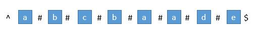
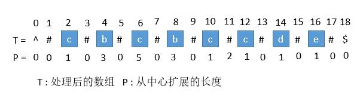
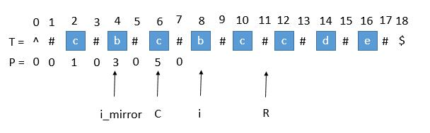
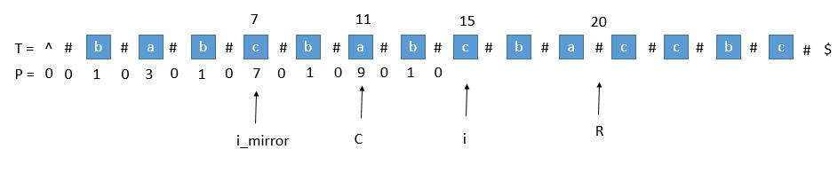
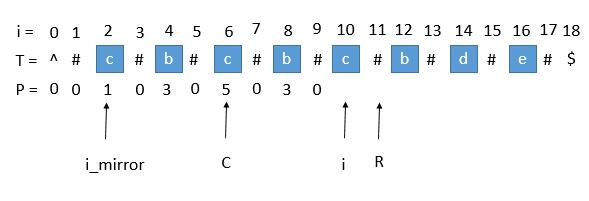

## 3. 无重复字符的最长子串

- 优化的滑动窗口

如果s\[j\]在[i,j)范围内有与j'重复的字符，我们不需要逐渐增加i；
我们可以直接跳过\[i，j'\]范围内的所有元素，并将i变为j'+1

算法：

保持一个int max变量来记录最长子串的长度，每次移动右指针时都重新比较当前窗口
的长度与max，如果当前窗口表示的子串长度大于max，则更新max

当s\[j'\] = s\[j\]时，如果[i, j)范围内都没有重复的元素，
那么最长的子串一定至少是s\[i, j-1\]，
将i移动到这个范围中的任何位置得到的都不会比这个子串长，
所以可以直接移动i到j'+1位置寻找下一个可能的最长子串

最后返回max即可

Note：
1. 使用哈希表来记录当前滑动窗口内有哪些字符，当移动右指针时向表内添加新遍历到的字符，
当移动左指针时从表内删除从窗口中排除掉的字符
2. 简化掉删除操作：如果哈希表保存的是"某字符在出现的最靠右位置的索引"而不是"是否在滑动窗口中出现"的话，
就可以通过这个索引判断字符是否在滑动窗口内，而不需要进行删除操作

原理：通过判断表内字符对应的索引是否在左指针左边；
原本在左指针左边的字符应该从表内删除，现在如果对应索引在左指针左边则忽略，若在右边，
则改变左指针位置；由于每次移动右指针都会更新右指针对应字符的索引，
发生s\[j'\] = s\[j\]情况时，左指针被移动到j+1位置，而此字符对应索引j'被更新到j

3. 哈希表将一个字符映射到其对应索引上，而使用一个散列表
（索引为对应字符的ASCII编码减去' '的编码，值为字符对应索引）
可以用空间换时间来提高效率


```java
class Solution3 { // Hashmap
    public int lengthOfLongestSubstring(String s) {
        char[] arr = s.toCharArray();
        if (arr.length == 0) return 0;
        int ptr1 = 0;
        int ptr2 = 0;

        int max = 1;
        Map map = new HashMap();

        while (ptr2 != arr.length) {
            if (map.containsKey(arr[ptr2])){
                if ((int) map.get(arr[ptr2]) >= ptr1) ptr1 = (int) map.get(arr[ptr2])+1;
            }
            map.put(arr[ptr2], ptr2);
            if (ptr2 - ptr1 + 1 > max) max = ptr2-ptr1+1;
            ptr2++;
        }
        return max;
    }
}
``` 

```java
class Solution3 { // Array
    public int lengthOfLongestSubstring(String s) {
        char[] arr = s.toCharArray();
        if (arr.length == 0) return 0;
        int ptr1 = 0;
        int ptr2 = 0;

        int max = 1;
        int[] map = new int[128];
        for (int i=0; i<128; i++) map[i] = -1;

        while (ptr2 != arr.length) {
            if (map[arr[ptr2]-' '] >= ptr1) ptr1 = map[arr[ptr2]-' '] + 1;
            map[arr[ptr2]-' '] = ptr2;
            if (ptr2 - ptr1 + 1 > max) max = ptr2 - ptr1 + 1;
            ptr2++;
        }
        return max;
    }
}
```

## 5. 最长回文子串

- 动态规划：刷表

横/纵坐标表示子串的起始位置，true/false表示这个子串是不是回文

 T | 0 | 1 | 2 | 3 |...| n-1 |
---|---|---|---|---|---| --- |
 0 | true | \ | \ | \ |...| \ |
 1 | s\[0\] == s\[1\] | true | \ | \ |...| \ |
 2 | s\[0\] == s\[2\] && T\[1\]\[1\] | s\[1\] == s\[2\] | true | \ |...| \ |
 3 | s\[0\] == s\[3\] && T\[1\]\[2\] | s\[1\] == s\[3\] && T\[2\]\[2\] | s\[0\] == s\[2\]| true |...| \ |
...|...|...|...|...|...| \ |
n-1| s\[0\] == s\[n-1\] && T\[1\]\[n-2\]| s\[1\] == s\[n-1\] && T\[2\]\[n-2\]| s\[2\] == s\[n-1\] && T\[3\]\[n-2\]| s\[3\] == s\[n-1\] && T\[4\]\[n-2\]|...| true |

表计算完毕后即可得到最长回文子串

- 动态规划：递归

按上表的表示方式，x为横坐标（子串开头），y为纵坐标（子串结尾）

如果我们把x > y（子串的开头在结尾后方）当做真的话：

1. 当x=y时，T\[x\]\[y\]一定为真，等于 (s\[x\] == s\[y\]) && T\[x+1\]\[y-1\]

    （x=y，故s\[x\]一定等于s\[y\]，x+1 > y-1，故T\[x+1\]\[y-1\]按照一开始的设定，为真）
    
2. 当x=y+1时，T\[x\]\[y\]等于 (s\[x\] == s\[y\]) && T\[x+1\]\[y-1\]

    （x+1 > y-1，故T\[x+1\]\[y-1\]按照一开始的设定，为真）
    
3. 其它情况同样，T\[x\]\[y\]等于 (s\[x\] == s\[y\]) && T\[x+1\]\[y-1\]

递归关系式：
f(x, y) = (s\[x\]==s\[y\]) && f(x+1, y-1) if x <= y
f(x, y) = true if x > y

（在类中）声明一个全局变量来记录每次递归得到的子串是否更长，如果是，将子串起始位置
记录在全局变量中，最终得到最长回文子串

- 动态规划：自底向上

先算出子问题的结果（父问题对应的格子右上角子问题的结果），再一路解决上层的问题直到结束。

同样（在类中）声明一个全局变量来记录每次解决的子问题对应的子串是否更长，如果是，将子串起始位置
记录在全局变量中，最终得到最长回文子串

- Manacher's Algorithm（马拉车算法）

先跪为敬...

马拉车算法 Manacher‘s Algorithm 是用来查找一个字符串的最长回文子串的线性方法，
由一个叫 Manacher 的人在 1975 年发明的，这个方法的最大贡献是在于将时间复杂度提升到了线性。

首先我们解决下奇数和偶数的问题，在每个字符间插入 "#"，
并且为了使得扩展的过程中，到边界后自动结束，在两端分别插入 "^" 和 "$"，
两个不可能在字符串中出现的字符，这样中心扩展的时候，判断两端字符是否相等的时候，
如果到了边界就一定会不相等，从而出了循环。经过处理，字符串的长度永远都是奇数了。



首先我们用一个数组 P 保存从中心扩展的最大个数，
而它刚好也是去掉 "#" 的原字符串的总长度。

例如下图中下标是 6 的地方，可以看到 P\[6\] 等于 5，
所以它是从左边扩展 5 个字符，相应的右边也是扩展 5 个字符，
也就是 "#c#b#c#b#c#"。而去掉 # 恢复到原来的字符串，
变成 "cbcbc"，它的长度刚好也就是 5。



#### 求原字符串下标

用 P 的下标 i 减去 P\[\i\]，再除以 2，就是原字符串的开头下标了。

例如我们找到 P\[i\] 的最大值为 5，也就是回文串的最大长度是 5，
对应的下标是 6，所以原字符串的开头下标是（6 - 5 ）/ 2 = 0。
所以我们只需要返回原字符串的第 0 到 第（5 - 1）位就可以了。

#### 求每个 P\[i\]

接下来是算法的关键了，它充分利用了回文串的对称性。

我们用 C 表示回文串的中心，用 R 表示回文串的右边半径。
所以 R = C + P\[i\]。C 和 R 所对应的回文串是当前循环中 R 最靠右的回文串。

让我们考虑求 P\[i\] 的时候，如下图。

用 i_mirror 表示当前需要求的第 i 个字符关于 C 对应的下标。



我们现在要求P\[i\]，如果是用中心扩展法，那就向两边扩展比对就行了。
但是我们其实可以利用回文串 C 的对称性。
i 关于 C 的对称点是 i_mirror，P\[i_mirror\] = 3，所以P\[i\] 也等于 3。

但是有三种情况将会造成直接赋值为P\[i_mirror\] 是不正确的，下边一一讨论。

1. 超出了 R



当我们要求P\[i\]的时候，P\[mirror\] = 7，而此时P\[i\]并不等于 7，
为什么呢，因为我们从 i 开始往后数 7 个，等于 22，已经超过了最右的 R，此时不能利用对称性了，
但我们一定可以扩展到 R 的，所以 P [ i ] 至少等于 R - i = 20 - 15 = 5，

会不会更大呢，我们只需要比较T\[R+1\]和T\[R+1\]关于 i 的对称点就行了，
就像中心扩展法一样一个个扩展。

2. P\[i_mirror\]遇到了原字符串的左边界



此时P\[i_mirror\] = 1，但是P\[i\]赋值成 1 是不正确的，
出现这种情况的原因是P\[i_mirror\]在扩展的时候首先是 "#" == "#"，
之后遇到了 "^" 和另一个字符比较，也就是到了边界，才终止循环的。
而P\[i\]并没有遇到边界，所以我们可以继续通过中心扩展法一步一步向两边扩展就行了。

3. i 等于了 R

此时我们先把P\[i\]赋值为 0，然后通过中心扩展法一步一步扩展就行了。

#### 考虑 C 和 R 的更新

就这样一步一步的求出每个P\[i\]，当求出的P\[i\]的右边界大于当前的 R 时，
我们就需要更新 C 和 R 为当前的回文串了。
因为我们必须保证 i 在 R 里面，所以一旦有更右边的 R 就要更新 R。


此时的P\[i\]求出来将会是 3，P\[i\]对应的右边界将是 10 + 3 = 13，
所以大于当前的 R，我们需要把 C 更新成 i 的值，也就是 10，R 更新成 13。
继续下边的循环。

例子：


## 7. 整数反转
- Case: -2147483648

Java整数只支持-2147483648 (-2^31) 到 2147483647 (2^31-1) 范围内的数字

如果遇到负数时乘-1处理, 遇到-2147483648会溢出, 因为**-2147483648是一个有效的java整数，但是2147483648并不是！（溢出）**, 

(**唯一java支持某个负数，但不支持其对应相反数（正数）的情况!**)
  
Note：使用long类型避免整数溢出情况!

## 27. 移除元素
除了把不同的数字向前移动，也可以把重复的数字向后移动


## 35. 搜索插入位置
执行二分搜索时，初始时tail应该是数组长度**而不是数组长度-1**
```java
        int head = 0;
        int tail = nums.length; // not "nums.length-1"
        int mid = (int) (head+tail)/2;;

```

## 38. 外观数列
It saves more time when appending string if you use StringBuilder, instead of string concentration
```java
        StringBuilder result = new StringBuilder();
        ...
        result.append(generate(cnt, last_digit));
```
this is much faster than
```java
        String result = new String();
        ...
        result = result+generate(cnt, last_digit);
```

## 53 最大字序和
常见极端情况:
- Array with only one element
- Empty array
- `Integer.MAX_VALUE/MIN_VALUE`

## 58. 最后一个单词的长度
Case: "a "

...fuck, I didn't expect space at the end

Case: " "

...fuck, I didn't expect only space either

Case: "   "

... fuck, fuck, fuck

Case: "a "

... fuck this shit

## 69. x 的平方根
**Use long datatype to avoid integer overflow issue**

Since the result keeps only integer part (left), when doing binary search, mid point should use left mid as well

### Gaussian Newton method:

To find the square root of target is equivalent to:

maximize f(x), where f'(x)=x^2-target

Then we can use Gaussian Newton to solve this optimization problem

x_{k+1} = x_{k} - f'(x)/f''(x)

where f'(x) = x^2-target, f''(x) = 2x 

iterate until we find one that is close enough

## 88. 合并两个有序数组 *
- 双指针 / 从后往前

直觉: 方法二已经取得了最优的时间复杂度O(n+m), 但需要使用额外空间。这是由于在从头改变nums1的值时，需要把nums1中的元素存放在其他位置。

如果我们从结尾开始改写 nums1 的值又会如何呢？**这里没有信息，因此不需要额外空间**。
这里的指针 p 用于追踪添加元素的位置。

So fuckin' brilliant


## 100. 相同的树 & 101. 对称二叉树

Visiting every node of a tree:
**Recursion: use DFS**
**Iteration: use BFS**

## 104. 二叉树的最大深度
Fuck trees, always beware of an empty tree (`Tree = []`)


## 136. 只出现一次的数字 *
- 如果我们对 0 和二进制位做 XOR 运算，得到的仍然是这个二进制位

    a⊕0=a
- 如果我们对相同的二进制位做 XOR 运算，返回的结果是 0

    a⊕a=0
- XOR 满足交换律和结合律

    a⊕b⊕a=(a⊕a)⊕b=0⊕b=b
    
所以对数组中所有数字依次进行异或运算，出现两次的数字异或之后变为0，
只有唯一一个只出现一次的数字与0异或，结果仍然是这个数字

**常规算法无法解决问题时，记得考虑能否使用位运算解决问题!!!**


## 141. 环形链表
- 自己的解法：

思路：遍历链表，每次经过一个节点时，把这个节点与下一个断开，并在这个节点后面连一个“特殊节点”

如果有环：那么一路遍历到链表最后，会因为有环而遍历到之前已经遍历过的一个节点，而这个节点在之前的操作中已经把下一个连接成了“特殊节点”，所以一路遍历下去时如果遇到这个“特殊节点”，则说明出现环，反而遍历到前面的某个节点了，返回true

如果没环：那么一路遍历到最后都不会跑回到前面已经遍历过的节点上，所以不会遇到“特殊节点”，那么到结尾null的时候停止并返回false即可

那么怎么设置这个“特殊节点”呢？这个节点的作用就是说明它连接的上一个节点已经被遍历过了，因此这个“特殊节点”必须足够特殊，以便跟链表里的其它节点区分开，所以我直接把头节点当成这个特殊节点（头节点是肯定不会在后面出现的，所以肯定可以区分开）。

**缺点：破坏了链表结构...**

- Floyd判圈算法：

一个可以在有限状态机、迭代函数或者链表上判断是否存在环，求出该环的起点与长度的算法。

如果有限状态机、迭代函数或者链表上存在环，那么在某个环上以不同速度前进的2个指针必定会在某个时刻相遇。同时显然地，如果从同一个起点(即使这个起点不在某个环上)同时开始以不同速度前进的2个指针最终相遇，那么可以判定存在一个环，且可以求出2者相遇处所在的环的起点与长度。

思路

想象一下，两名运动员以不同的速度在环形赛道上跑步会发生什么？


通过**使用具有不同速度的快、慢两个指针遍历链表**，空间复杂度可以被降低至 
O(1)。慢指针每次移动一步，而快指针每次移动两步。

如果列表中不存在环，最终快指针将会最先到达尾部，此时我们可以返回 false。

现在考虑一个环形链表，把慢指针和快指针想象成两个在环形赛道上跑步的运动员（分别称之为慢跑者与快跑者）。而快跑者最终一定会追上慢跑者。这是为什么呢？考虑下面这种情况（记作情况 A）- 假如快跑者只落后慢跑者一步，在下一次迭代中，它们就会分别跑了一步或两步并相遇。

其他情况又会怎样呢？例如，我们没有考虑快跑者在慢跑者之后两步或三步的情况。但其实不难想到，因为在下一次或者下下次迭代后，又会变成上面提到的情况 A。


## 155. 最小栈

- 一开始的思路：维护一个堆来存储所有放入栈的数字，获取最小值时返回堆顶部的数字即可

- 问题：虽然获取最小值的时间复杂度为常数，但是放入/取出元素时复杂度为对数

- 忽略的条件：取出元素时一定是按照入栈顺序取出，所以没有必要使用堆结构获取最小值（取出元素顺序不固定时才只能使用堆）

- 标准答案：额外维护一个链表来存储放入/取出每一层栈时栈内元素的最小值（而不是用来存储放入栈的元素）


## 448. 找到所有数组中消失的数字

- 原地修改

我们需要知道数组中存在的数字，由于数组的元素取值范围是 \[1, N\]，所以我们可以不使用额外的空间去解决它。
我们可以在输入数组本身以某种方式标记已访问过的数字，然后再找到缺失的数字。
算法：

遍历输入数组的每个元素一次。
我们将把 abs(nums\[i\])-1 索引位置的元素标记为负数。即 

nums\[abs(nums\[i\])−1\] *= −1 。

然后遍历数组，若当前数组元素 nums\[i\] 为负数，说明我们在数组中存在数字 i+1。

Note:

1. 由于数字范围为\[1, N\]， **数字范围与索引范围是一一映射的**，故可以**利用数组索引存储额外的关于已经遍历的数字的信息**
2. 要**利用数组索引存储额外信息**，又**不能丢失原有信息**（不能替换数组中其它元素），可以**将数组对应位置的数字乘-1来表示已经遍历的数字**

（由于数组中数字都大于0，所以乘-1不会丢失原有信息，负数则表示这个索引对应数字已被遍历）


## 167. 两数之和 II - 输入有序数组

有序数组时，考虑使用双指针

当两数之和大于目标时，右指针左移使两数之和减小；当两数之和小于目标时，左指针右移使两数之和增大；

**由于数组有序，所以使两数之和增加/减小只需将两个指针中的一个向一个方向移动即可**，

左指针从左开始，故要减小只需要左移右指针；右指针从右开始，故要增大只需要右移左指针

```java
class Solution {
    public int[] twoSum(int[] numbers, int target) {
        int start = 0;
        int end = numbers.length-1;

        while (true) {
            if (numbers[start] + numbers[end] == target) return new int[]{start + 1, end + 1};
            else if (numbers[start] + numbers[end] > target) end--;
            else start++;
        }
    }
}
```

## 168. Excel表列名称
莫名其妙一个题...卡的时候卡了一个多小时，最后随手一改过了

问题关键是**模26的时候，余0实际上要减掉26**...

因为在**满26的时候实际上是Z而不是进位**，所以模出0的时候需要特殊处理，即减去26取消进位
```java
class Solution168 {
    public char map(int remainder) {
        return (char) (remainder+64); // 0-'Z' 1-'A' 2-'B'...25-'Y'
    }

    public String convertToTitle(int n) {
        StringBuilder ans = new StringBuilder();
        int remainder;

        while (n > 26) {
            // 如果满26的话不是进位而是Z，所以把余数换成26
            // 这样转化为字符的时候不会出错，除的时候先减去余数也不会导致进位
            remainder = n%26==0 ? 26: n%26; 
            ans.append(map(remainder));
            n -= remainder;
            n = n/26;
        }
        ans.append(map(n));
        return new String(ans.reverse());
    }
}
``` 

## 169. 多数元素
Boyer-Moore 投票算法

- 原理：

我们假设这样一个场景，在一个游戏中，分了若干个队伍，有一个队伍的人数超过了半数。所有人的战力都相同，不同队伍的两个人遇到就是同归于尽，同一个队伍的人遇到当然互不伤害。

这样经过充分时间的游戏后，最后的结果是确定的，一定是超过半数的那个队伍留在了最后。

- 做法：

我们维护一个计数器，如果遇到一个我们目前的候选多数元素，就将计数器加一，
否则减一。只要计数器等于 0 ，我们就将nums中之前访问的数字全部忘记 ，
并把下一个数字当做候选的多数元素。


## 171. Excel表列序号
正着做就不需要考虑满26的边界情况了，Z的时候直接乘26即可

Note：做进制转换的时候不需要傻乎乎的用Math.pow()，用一个
int base = 1; 循环内 base *= 26; 可以大幅节省时间

```java
class Solution171 {
    public int titleToNumber(String s) {
        int ans = 0;
        int len = s.length();
        int base = 1; // 每一轮循环的base

        for (int i=0; i<len; i++){
            ans += base*(s.charAt(len-1-i)-'A'+1);
            base *= 26; // 进入下一轮循环时base*26，这样就不需要使用pow函数计算幂了
        }

        return ans;
    }
}
``` 


## 172. 阶乘后的零

一开始以为直接返回n/5即可（几个含因子5的数字就是几个0）

但是测试样例为30时有7个而不是6个0，原因是25含有两个5因子...
那就多计算一遍含有5的幂的数字有几个，再加上对应的幂大小即可
```java
class Solution {
    public int trailingZeroes(int n) {
        long base = 5;
        int zeroes = 0;
        while (n >= base) {
            zeroes += n/base;
            base*=5;
        }

        return zeroes;
    }
}
```

## 189. 旋转数组

- 反转

这个方法基于这个事实：当我们旋转数组k次， k%n 个尾部元素会被移动到头部，剩下的元素会被向后移动。

在这个方法中，我们首先将所有元素反转。然后反转前 k 个元素，再反转后面 n−k 个元素，就能得到想要的结果。

```
假设 n=7 且 k=3 。

原始数组                  : 1 2 3 4 5 6 7
反转所有数字后             : 7 6 5 4 3 2 1
反转前 k 个数字后          : 5 6 7 4 3 2 1
反转后 n-k 个数字后        : 5 6 7 1 2 3 4 --> 结果
```

## 190. 颠倒二进制位

由于java不支持unsigned，所以如果除2来判断最后一位的话遇到负数会无法正确处理

所以需要**用 n & 0b1 的方式得到最后一位**

## 202. 快乐数

- Floyd判圈算法：

一个可以在有限状态机、迭代函数或者链表上判断是否存在环，求出该环的起点与长度的算法。

如果有限状态机、迭代函数或者链表上存在环，那么在某个环上以不同速度前进的2个指针必定会在某个时刻相遇。
同时显然地，**如果从同一个起点(即使这个起点不在某个环上)同时开始以不同速度前进的2个指针最终相遇，
那么可以判定存在一个环**，且可以求出2者相遇处所在的环的起点与长度。

## 204. 计数质数

- 厄拉多塞筛法

如求N之内的质数，首先列出2~N-1的所有数，**如果当前数为质数，则其倍数就是质数，将其所有小于N的倍数排除即可**

例如：

第一个质数为2，在2上画圈，其倍数4/6/8...不是质数，划掉4/6/8...，继续遍历

下一个质数为3，在3上画圈，其倍数6/9/12...不是质数，划掉6/9/12...，继续遍历

下一个质数为5，在5上画圈，其倍数10/15/20...不是质数，划掉10/15/20...，继续遍历

下一个质数为7，在7上画圈，其倍数14/21/28...不是质数，划掉14/21/28...，继续遍历

下一个质数为...

不需要特地判断当前数字（如：i）是否为质数，如果i在之前没有被划掉，则i就是质数

**证明：因为如果i不是质数（没被划掉），则i一定拥有一个小于i的因子（如：j, j<i），
而之前遍历到j的时候就应该已经划掉i（i=k*j）了，矛盾**

所以如果一个数（i）在之前没被划掉，则它一定是质数

将遍历时遇到没被划掉的数字计数，则得到小于N的质数的总数

## 205. 同构字符串

Tips:

1. 遍历字符串时，先将字符串转为数组再访问会比直接访问字符串中的每个字符快

```java
// 遍历字符串：
...
        for (int i = 0; i < len; i++) {
            c1 = s.charAt(i);
            c2 = t.charAt(i);
...

// 遍历数组：
...
        char[] arr1 = s.toCharArray();
        char[] arr2 = t.toCharArray();

        for (int i = 0; i < len; i++) {
            c1 = arr1[i]-' '+1;
            c2 = arr2[i]-' '+1;
...
```

2. 空间允许时，直接使用一个很大长度的数组比使用Hashmap更快
```java
// Hashmap
...
        Map map = new HashMap();
        ...
        
            if (map.containsKey(c1)) {
                if ((char) map.get(c1) != c2) return false;
            } else if (map.containsValue(c2)) return false;
            else {
                map.put(c1, c2);
            }
...
         
// int[]
...
        int[] map1 = new int[100];
        int[] map2 = new int[100];
        ...
        
            if (map1[c1] != 0) {
                if (map1[c1] != c2) return false;
            }
            else if (map2[c2] != 0) {
                if (map2[c2] != c1) return false;
            }
            else {
                map1[c1] = c2;
                map2[c2] = c1;
            }
...
```
（使用数组的话无法像Hashmap一样使用Hashmap.containsValue()，所以使用两个数组避免遍历查找value）

## 206. 反转链表

迭代的话很好写，递归很tricky

错误的想法是每次递归返回一个逆转链表的头和尾，然后把节点一个个加在逆转链表的尾部；

这样写由于每次return的必须有头节点（否则最后得到结果只有链表的尾节点）和尾节点（不然无法快速把一个节点附加在逆转链表尾部）

tricky的做法是返回的不是一个标准的链表，而只是后半部分连接顺序反向的V字形链表，
**正向链表和反向链表指向同一个尾节点，每次递归将这个尾节点向左移动，即只改变正向部分最后一个节点和逆向部分最后一个节点间指向的方向**

**每次递归结束之后正向部分节点数-1，逆向部分节点数+1**

这样做无需每次递归保留头节点和尾节点的信息了，因为在每次递归中：

**head是正向部分的最后一个节点，而head指向的下一个节点又是逆向链表的尾节点**，
这样就不需要特地保存逆向链表的尾节点信息了

并且**每次递归只是把这个head节点加在逆向链表的尾节点之后，返回的仍旧是逆向链表的头节点（tail，表示整个链表的尾部最后一个节点）**

`head.next.next = head;`
head.next是逆向部分的最后一个节点，head.next.next = head等于给逆向部分增加一个head节点

`head.next = null;` 最后将head指向null，将head节点从正向链表上拆下来

等于只是将head与head.next两个节点的指向方向逆转一下，每次递归逆转一对节点间连接的方向，
最后递归完成时整个链表被逆转


- 递归

递归版本稍微复杂一些，其关键在于反向工作。假设列表的其余部分已经被反转，现在我该如何反转它前面的部分？

假设列表为：

n1 → ... → nk−1 → nk → nk+1 → ... → nm → null
​	
若从节点nk+1到nm已经被反转，而我们正处于nk
 
n1 → ... → nk−1 → nk → nk+1 ← ... ← nm
 
我们希望nk+1的下一个节点指向nk；所以，nk.next.next = nk

```java
class Solution {
    public ListNode reverseList(ListNode head) {
        if (head == null) return null;
        if (head.next == null) return head;

        ListNode tail = reverseList(head.next);
        head.next.next = head; // fuck this step, bitch ass tricky
        head.next = null;
        
        return tail;
    }
}
```

## 217. 存在重复元素

- 猴子算法（纯搞笑...）

"我来搞笑了，随机算法，掷10万次2个骰子（面数等于数组长度--等于从数组中随机抽两个数出来），
万一发现有一次一样的就有，10万次都不一样就当做不存在重复吧，特殊案例再处理一下。"

蒙特卡洛：
如果存在重复并且抽样的次数足够多，
大概率存在某一次正好可以将重复的两个元素抽出来。

## 219. 存在重复元素 II

- 哈希表

错误样例：{1,0,1,1}

原因：1出现第二次时没有及时更新索引为2，导致1第三次出现时还是按照第一次的索引0计算距离

注意元素可能出现不止两次，所以出现第二次时要更新哈希表中索引位置（更换为靠后的那个索引），
不然出现第三次时还是按第一次出现的位置计算，导致结果错误

- 集合

思路

用散列表来维护这个k大小的滑动窗口。

算法

遍历数组，对于每个元素做以下操作：在散列表中搜索当前元素，如果找到了就返回 true。
在散列表中插入当前元素。如果当前散列表的大小超过了k， 删除散列表中最旧的元素。
返回 false。